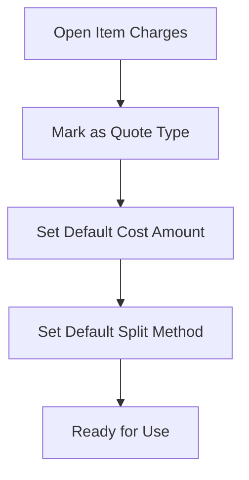
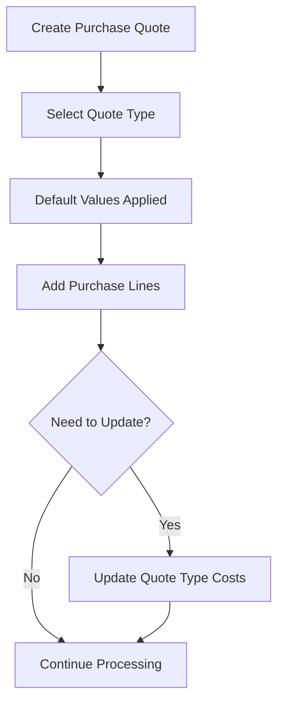
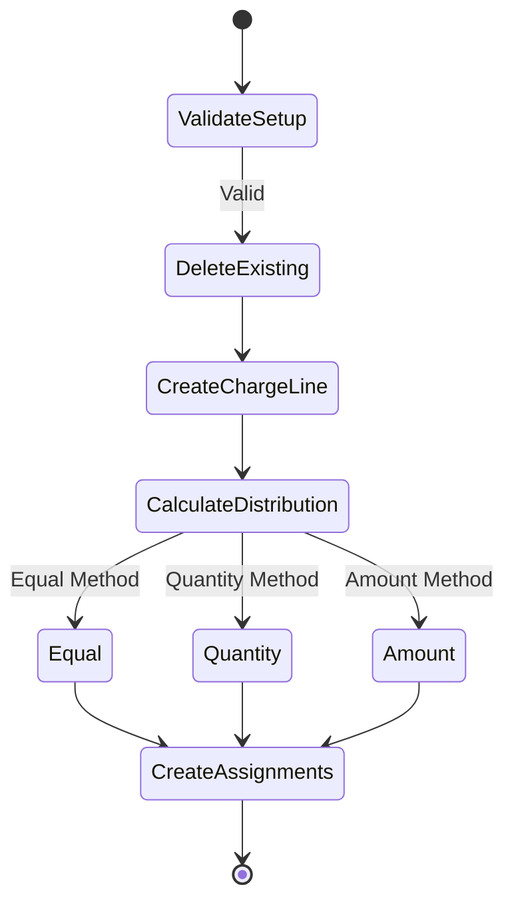

# Purchase Quote Types Extension for Business Central

## Overview
This extension enhances the standard Business Central purchase quote functionality by adding support for predefined quote types with automated cost distribution. It enables users to define different types of quotes (e.g., full load collection, full load delivery, small projects) and automatically distribute their associated costs across purchase lines.

## Features
- Define item charges as quote types with default cost amounts and split methods
- Automatically apply quote type costs to purchase quote lines
- Support for three cost distribution methods:
  - Equal distribution
  - Quantity-based distribution
  - Amount-based distribution
- Quick filtering for quote type item charges
- Default cost and split method inheritance

## Setup
1. Open Item Charges page
2. Mark relevant item charges as quote types
3. Set default cost amounts and split methods for each quote type

## Usage
1. Create new purchase quote
2. Select quote type from the Quote Type FastTab
3. Default cost amount and split method are automatically applied
4. Modify values if needed
5. Use "Update Quote Type Costs" action to redistribute costs

## Technical Details

### Tables Extended
- `Item Charge` - Added fields for quote type functionality
- `Purchase Header` - Added quote type related fields and logic

### Pages Extended
- `Item Charges` - Added quote type fields and filtering
- `Purchase Quote` - Added quote type FastTab and update action

### New Objects
- Enum `Cost Split Method` - Defines available distribution methods
- Codeunit `Quote Type Management` - Handles core quote type logic

## Process Diagrams

### Quote Type Setup Flow

### Purchase Quote Usage Flow

### Cost Distribution Process

## Field Descriptions

| Field | Description | Usage |
|-------|-------------|--------|
| Is Quote Type | Marks an item charge as available for quote types | Setup on Item Charge |
| Default Cost Amount | Standard cost to apply when using this quote type | Setup on Item Charge |
| Default Cost Split Method | How costs should be distributed by default | Setup on Item Charge |
| Quote Type Item Charge Code | Selected quote type on purchase quote | Used on Purchase Quote |
| Quote Type Cost Amount | Actual cost amount to distribute | Used on Purchase Quote |
| Cost Split Method | How costs will be distributed | Used on Purchase Quote |
